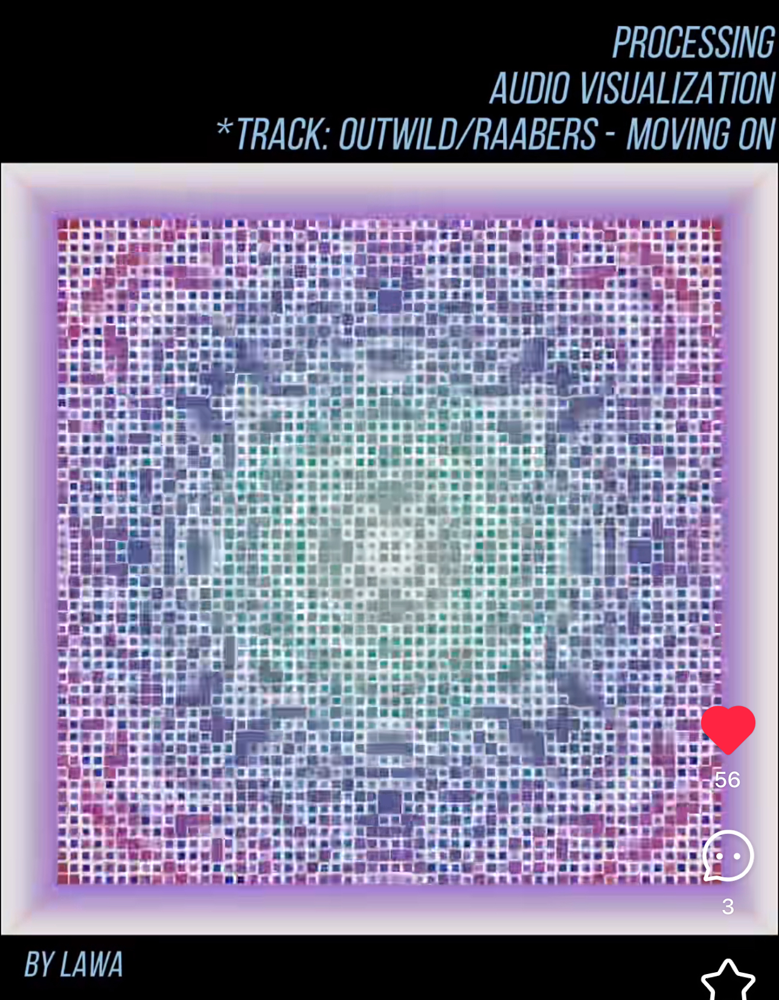

# 🎨 Quiz 8 – Imaging & Coding Technique Exploration

## Part 1: Imaging Technique Inspiration

I was inspired by the ripple-like motion of particles that respond to mono or multi-channel audio. When the sound is simple, it creates smooth waves; as harmonies build up, it forms a complex, kaleidoscope-like pattern. I want to apply this idea to a point-based artwork by making the dots react rhythmically to audio input, enhancing its emotion and helping viewers better understand the style and theme.

### Example Screenshots
  
*A screenshot showing gentle ripple patterns generated by simple mono audio input*

  
*A screenshot showing symmetric kaleidoscope-like visuals triggered by layered harmonies*

---

## Part 2: Coding Technique Exploration

This project uses p5.js and FFT to create kaleidoscopic visuals that react to audio. By analyzing frequency and amplitude, it generates symmetric particle waves that respond dynamically to sound. This technique can help me simulate ripple effects and color shifts in my own work.

🔗 [View example project](https://editor.p5js.org/kjhollen/sketches/4ikb9I3M5)

### Screenshot of Code in Action
  
*A visual showing how particles form symmetric patterns in response to real-time FFT analysis*

---

*Commit label: `Quiz 8`*
